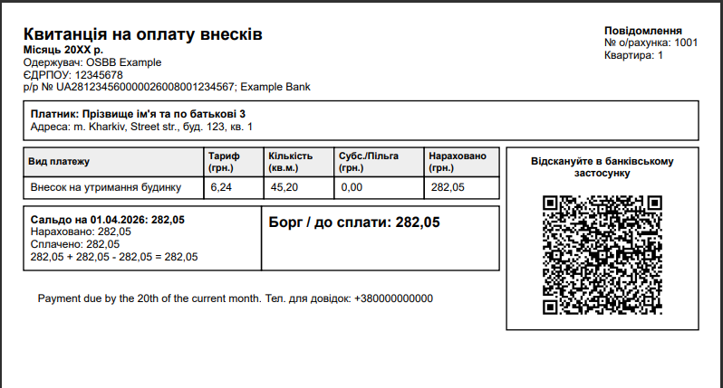

# OSBB Invoice Generator

Готовий консольний генератор, який:

- читає зведену Excel-відомість ОСББ
- витягує дані по кожному особовому рахунку
- генерує **окремий PDF-файл для кожного рахунку**
- використовує шаблон квитанції, близький до твого зразка

## Технології

- `ClosedXML` — читання `.xlsx`
- `QuestPDF` — генерація PDF

## Що очікує від Excel

Скрипт заточений під структуру, яку ти вже завантажував:

- колонка **Особистий рахунок**
- колонка **П.І.Б.**
- колонка **Квартира**
- **Сальдо на початок місяця**
- **Платежі за поточний місяць**
- два стовпці нарахувань:
  - `Внесок на утримання будинку (нежитловий фонд)`
  - `Внесок на утримання будинку`
- **Всього нараховано**
- **Сальдо на кінець місяця**
- **Платежі за наступний місяць**

## Швидкий старт

```bash
dotnet restore
dotnet run -- \
  --input "../Відомость-березень-2026.xlsx" \
  --output "./out" \
  --org-name "ОСББ  ACME" \
  --edrpou "12345678" \
  --iban "UA281234560000026008001234567" \
  --bank "Bank Name" \
  --city "м. City" \
  --street "Street str." \
  --building "123" \
  --phone "057-1234567"
```

## Результат

Після запуску в папці `out` будуть файли такого виду:

```text
receipt_1001.pdf
receipt_1002.pdf
receipt_1003.pdf
...
receipt_2030.pdf
```

[](../../assets/sample-receipt.pdf)

_це приклад згенерованої квитанції_

## Що вже враховано

- адреса квартири збирається автоматично з конфігурації + номера квартири
- особові рахунки `20xx` позначаються як **комірки / нежитлові приміщення**
- період береться з Excel автоматично
- якщо в одному з двох стовпців нарахувань `0,00`, він просто не виводиться окремим рядком
- якщо є переплата, в PDF буде показано **Переплата**, а не **Борг**

## Де змінювати шаблон квитанції

Основний макет PDF тут:

```text
Services/InvoicePdfRenderer.cs
```

Там можна легко:
- поміняти тексти
- змінити розміри сторінки
- зробити більш "банківський" або компактний стиль

## Обмеження поточної версії

Ця версія читає **агреговані** значення з Excel. Тобто:
- бачить суму сплати за місяць
- але **не бачить окремі дати платежів**, якщо їх немає в Excel

Якщо потім захочеш, можна розширити до:
- читання окремої таблиці платежів
- підстановки QR-коду
- масового архівування всіх PDF в ZIP
- генерації 2 квитанцій на сторінці
